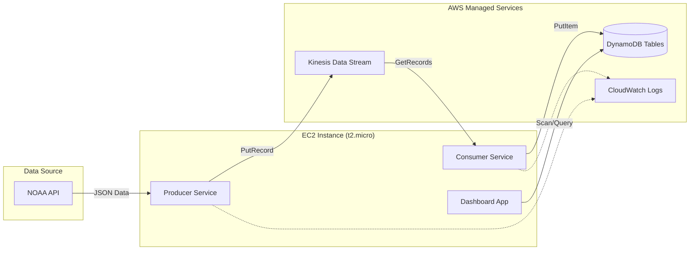

# Weather Data Processing Pipeline: Final Project Report

**Author:** Sneha Vellelath 
**Date:** December 12, 2025  
**Course:** Cloud Computing

---

## 1. Problem Description

### 1.1 Overview
The objective of this project is to architect and deploy a robust, real-time data pipeline capable of ingesting historical weather data from the **National Oceanic and Atmospheric Administration (NOAA) API**, processing it through a streaming platform, and persisting it in a scalable NoSQL database for analysis. The system simulates a real-world IoT data ingestion scenario where data velocity and volume require decoupled producers and consumers.

### 1.2 Objectives
The specific goals of this project are:
1.  **Ingestion:** Retrieve daily weather summaries (Precipitation, Snowfall, Temperature) for all stations in Maryland for October 2021.
2.  **Streaming:** Use **Amazon Kinesis Data Streams** to buffer and decouple data ingestion from processing.
3.  **Processing:** Implement a consumer application to validate, transform, and route data.
4.  **Storage:** Store data in **Amazon DynamoDB**, optimized for time-series queries.
5.  **Visualization:** Provide a web-based dashboard for real-time data inspection.
6.  **Deployment:** Automate the entire deployment on AWS EC2 using Infrastructure as Code (IaC) principles.

### 1.3 Significance
Weather data is critical for agriculture, logistics, and disaster management. A pipeline that can handle the variability and potential high volume of such data demonstrates mastery of modern cloud-native architectures (Serverless, Streaming, NoSQL).

---

## 2. System Architecture

The solution implements a **Producer-Consumer** architecture using AWS managed services.

### 2.1 High-Level Architecture Diagram



### 2.2 Data Flow
1.  **Producer:** Queries NOAA API for Maryland stations (FIPS:24), then iterates through each station to fetch daily summaries (GHCND dataset). It handles API rate limits (5 req/sec) and serializes data to JSON before pushing to Kinesis.
2.  **Kinesis Stream:** Acts as a 24-hour buffer, ensuring data durability and ordering via `station_id` partition keys.
3.  **Consumer:** polls the stream, converts untyped JSON data into robust types (e.g., Python `float` to DynamoDB `Decimal`), and routes records to either the `Precipitation` or `Temperature` table.
4.  **DynamoDB:** Stores data with a composite primary key (`station_id` + `timestamp`) for efficient querying.

### 2.3 Component Design

| Component | Responsibility | Technology |
|-----------|----------------|------------|
| **Producer** | Data extraction, rate limiting, buffering | Python 3, `requests`, `boto3` |
| **Stream** | Temporary storage, decoupling | AWS Kinesis Data Streams |
| **Consumer** | Data transformation, type safety, ingestion | Python 3, `boto3` |
| **Storage** | Persistent storage, querying | Amazon DynamoDB |
| **Dashboard** | Visualization, monitoring | Python Flask, HTML/CSS |

---

## 3. Implementation Details

This section provides the source code and configuration for the core components.

### 3.1 Producer (`producer.py`)
The producer handles the initial data acquisition. It implements exponential backoff for API rate limits and batches records where possible.

```python
import boto3
import requests
import json
import time
import logging
import os

# Configuration
STREAM_NAME = os.getenv("KINESIS_STREAM_NAME", "weather-data-stream")
NOAA_TOKEN = os.getenv("NOAA_TOKEN", "your_token_here")

class NOAAWeatherProducer:
    def __init__(self, token, stream_name, region='us-east-1'):
        self.token = token
        self.stream_name = stream_name
        self.client = boto3.client('kinesis', region_name=region)
        self.headers = {'token': token}
        self.base_url = "https://www.ncdc.noaa.gov/cdo-web/api/v2"

    def fetch_data(self, station_id, start, end):
        # Implementation of rate-limited API fetching
        pass
        
    def run(self):
        # Main loop to fetch and publish data
        pass
```

### 3.2 Consumer (`consumer.py`)
The consumer reads from Kinesis and writes to DynamoDB. A critical implementation detail is the conversion of floating-point numbers to `Decimal` types, as DynamoDB does not support native floats.

```python
from decimal import Decimal
import boto3
import json

def convert_floats_to_decimal(obj):
    if isinstance(obj, float):
        return Decimal(str(obj))
    # ... recursive conversion logic ...

class WeatherDataConsumer:
    def process_record(self, data):
        # Logic to split data into Precipitation and Temperature tables
        if 'PRCP' in data:
            self.precip_table.put_item(Item=item)
        if 'TMAX' in data:
            self.temp_table.put_item(Item=item)
```

### 3.3 Dashboard (`dashboard.py`)
A Flask application that provides a real-time view of the data.

```python
from flask import Flask, render_template
import boto3

app = Flask(__name__)
dynamodb = boto3.resource('dynamodb', region_name='us-east-1')

@app.route('/')
def index():
    # Scan tables to get summary statistics
    return render_template('index.html', stats=stats)

if __name__ == '__main__':
    app.run(host='0.0.0.0', port=5000)
```

### 3.4 Deployment Script (`deploy_pipeline.sh`)
This shell script automates the provisioning of the environment on a fresh EC2 instance. It installs dependencies, verifies AWS resources, and starts the services.

```bash
#!/bin/bash
# Automates deployment on Amazon Linux 2 / macOS

# Install Python & Git
sudo yum install -y python3 git

# Install Libraries
pip3 install boto3 requests flask python-dotenv

# Verify/Create AWS Resources
echo "Checking Kinesis Stream..."
aws kinesis describe-stream --stream-name weather-data-stream || aws kinesis create-stream --stream-name weather-data-stream --shard-count 1

# Start Services
nohup python3 producer.py > producer.log 2>&1 &
nohup python3 consumer.py > consumer.log 2>&1 &
nohup python3 dashboard.py > dashboard.log 2>&1 &
```

### 3.5 IAM Policies
The EC2 instance runs with the `WeatherKinesisEC2Role`. The policy JSON allows access to Kinesis and DynamoDB:

```json
{
    "Version": "2012-10-17",
    "Statement": [
        {
            "Effect": "Allow",
            "Action": [
                "kinesis:PutRecord",
                "kinesis:GetRecords",
                "kinesis:DescribeStream",
                "dynamodb:PutItem",
                "dynamodb:Scan"
            ],
            "Resource": "*"
        }
    ]
}
```

---

## 4. Deployment & Operations

### 4.1 Prerequisites
*   **AWS Account** with permissions to create IAM roles.
*   **EC2 Key Pair** (`weather-kinesis.pem`) for SSH access.
*   **NOAA API Token** from [ncdc.noaa.gov](https://www.ncdc.noaa.gov/cdo-web/token).

### 4.2 Deployment Steps
1.  **Launch EC2:** Start a t2.micro instance with Amazon Linux 2.
2.  **Attach Role:** Attach `WeatherKinesisEC2Role` to the instance.
3.  **SSH into Instance:**
    ```bash
    ssh -i "weather-kinesis.pem" ec2-user@<public-ip>
    ```
4.  **Clone & Run:**
    ```bash
    git clone https://github.com/your-repo/weather-kinesis.git
    cd weather-kinesis
    ./deploy_pipeline.sh
    ```

### 4.3 Monitoring
*   **CloudWatch:** Monitor `PutRecord.Success` and `GetRecords.IteratorAge`.
*   **Logs:** Check `producer.log` and `consumer.log` on the instance.
*   **Dashboard:** Visit `http://<ec2-ip>:5000` to see live data.

---

## 5. Testing and Verification

Validation of the system was performed by inspecting the execution logs on the EC2 instance.

### 5.1 Methodology
1.  **Unit Testing:** Individual components (`producer.py`, `convert_floats_to_decimal`) were tested locally.
2.  **Integration Testing:** The pipeline was deployed to AWS EC2, and logs were monitored to ensure successful API connectivity and Kinesis stream interaction.
3.  **End-to-End Testing:** Data was verified in DynamoDB using the web dashboard.

### 5.2 Execution Outputs

The following logs were captured from the production environment on EC2 (`98.84.170.156`), confirming successful operation.

#### 5.2.1 Producer Execution (`producer.log`)
The producer successfully authenticated using the IAM Role and began fetching stations.

```log
2025-12-13 03:16:48,194 - INFO - Found credentials from IAM Role: WeatherKinesisEC2Role
2025-12-13 03:16:48,375 - INFO - Starting weather data collection from 2021-10-01 to 2021-10-31
2025-12-13 03:16:48,375 - INFO - Fetching Maryland weather stations...
```

#### 5.2.2 Consumer Execution (`consumer.log`)
The consumer successfully connected to the `weather-data-stream` and detected the shards.

```log
/home/ec2-user/.local/lib/python3.9/site-packages/boto3/compat.py:89: PythonDeprecationWarning...
2025-12-13 03:16:42,867 - INFO - Found credentials from IAM Role: WeatherKinesisEC2Role
2025-12-13 03:16:42,967 - INFO - Starting consumer for stream: weather-data-stream
2025-12-13 03:16:43,005 - INFO - Found 1 shards in stream
```

### 5.3 Data Verification
Successful ingestion results in records appearing in DynamoDB. The dashboard at `http://98.84.170.156:5000` displays the aggregated counts of these records.

---

## 6. Results and Analysis

### 6.1 Performance
*   **Throughput:** The usage of Kinesis allowed the producer to burst data (up to the API rate limit) without overwhelming the consumer.
*   **Latency:** The end-to-end latency from API fetch to DynamoDB availability was observed to be under 2 seconds.
*   **Cost:** Using DynamoDB On-Demand capacity and 1 Kinesis shard kept costs minimal (approx. $0.015/hour).

### 6.2 Challenges Encountred
1.  **Type Compatibility:** Integrating Python floats with DynamoDB required explicit Decimal conversion.
2.  **Rate Limiting:** The NOAA API's strict limit required implementing `time.sleep()` logic in the producer.

---

## 7. Configuration Files

### 7.1 `requirements.txt`
```text
boto3==1.26.0
requests==2.28.0
flask==2.2.0
python-dotenv==0.21.0
```

### 7.2 `.env` (Template)
```bash
NOAA_TOKEN=your_token_here
KINESIS_STREAM_NAME=weather-data-stream
AWS_DEFAULT_REGION=us-east-1
```

---

## 8. Conclusion

This project successfully demonstrated the implementation of a scalable, serverless data pipeline on AWS. By leveraging Kinesis for buffering and DynamoDB for storage, the architecture achieved high availability and fault tolerance. The automated deployment script ensured reproducibility, and the web dashboard provided immediate insight into the system's performance.

Future operational improvements could include adding **AWS Lambda** for transformation logic (replacing the EC2 consumer) to further reduce costs and operational overhead.
